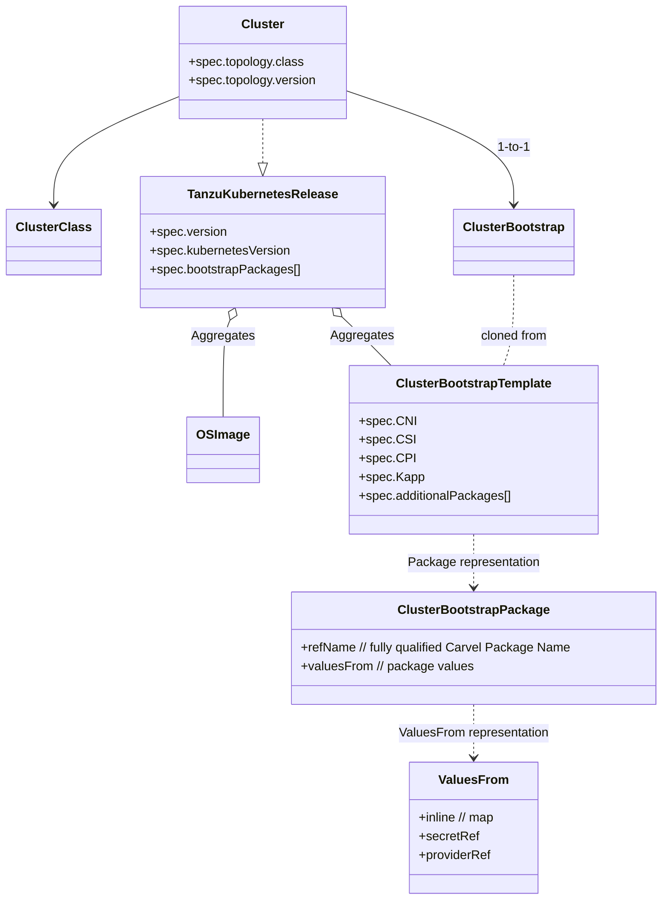

# Tanzu Addons Manager

Tanzu Addons Manager manages the lifecycle of core Carvel packages such as Kapp-controller, CNI, CPI, CSI and a list of arbitrary Carvel Packages. 
The mechanism for determining the versions of packages are determined by an imgpkg bundle that contains a number of resources which are described below.

## APIs

The following are the primary APIs used by the addons manager for determining what packages, versions and configurations go into a kubernetes cluster.

1. **TanzuKubernetesRelease(tkr)** - This is a resource that represents a summary of items contained in a Tanzu Kubernetes release. 
It aggregates VM images using OSImages Resource, packages and versions shipped with a release. It specifies all the components 
that will be automatically life cycled managed.
2. **ClusterBootstrapTemplate(cbt)** - This is a cookie cutter template resource of opinionated Carvel packages and their configurations that will be installed on a cluster.
There is a 1:1 relationship with tkr resource. This establishes a mapping of compatibility between a kubernetes version and a package version.
3. **ClusterBootstrap(cb)** - This is a resource that has 1:1 relationship with a Cluster resource. When a tanzu cluster is created a cbt resource is cloned to create a cb resource.
Once cloned the cb resource has no linkage to a cbt until a new version of tkr is rolled out and the tkr components update the version

The next set of APIs are used to provide values for configuring packages in ClusterBootstrap. Tanzu-framework defines 
a set of APIs for core packages, but they can be overriden by an OEM distributor of Tanzu by bringing their own mechanism of 
configuring their package. See the provider model below for more information

1. **KappControllerConfig** - This is a resource that represents the configuration of kapp-controller carvel package.
2. **AntreaConfig** - This is a resource that represents the configuration of antrea carvel package.
3. **CalicoConfig** - This is a resource that represents the configuration of calico carvel package.
4. **VSphereCPIConfig** - This is a resource that represents the configuration of vsphere cloud provider carvel package for both paravirtual and non-paravirtual modes of operation.
5. **VSphereCSIConfig** - This is a resource that represnets the configuration of vsphere csi carvel package for both paravirtual and non-paravirtual modes of operation.

## Webhooks
1. A validating webhook for ClusterBootstrapTemplate ensures that
   1. it can only be created in a system namespace
   2. required packages such as kapp and cni are set
   3. only type of valuesFrom is defined for a package
   4. it is immutable
2. A validating webhook for ClusterBootstrap ensures that
   1. required packages such as kapp and cni are set and valid
   2. any package being set is available in a system namespace(provided by TKR components)
   3. an update does not remove required packages
   4. an update does not downgrade a package version
   5. an update does not delete any package
   6. an update does not change package ref for core packages, for example changing cni from antrea to calico is not allowed
   7. an update does not alter the mechanism used to provide valuesFrom
3. A defaulting webhook for ClusterBootstrap is a convenience to enable API users to provide partial objects with an annotation 
to fill missing information from a ClusterBootstrapTemplate. This allows a user to customize packages or specific package in a cluster.

## Object relationship

## Sequence of operations

### Create
### Upgrade

## Customizing a cluster

## Provider model
### contract

## How to bring your own package as a managed addon
### Decision diagram
### Create carvel package
### Decide how to plumb data values
### API + Controller
### Add to TKr bundle or OEM partner bring your own TKr

